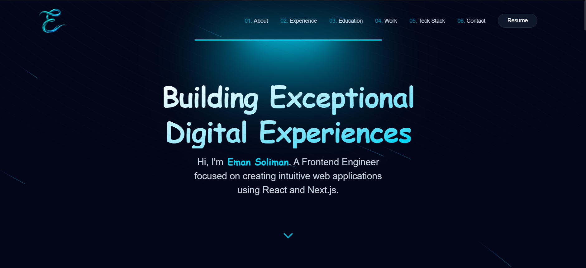

#  Eman Soliman \| Creative Developer Portfolio



**[Live Demo]()**

A modern, high-performance portfolio website built with **React.js**,
**TypeScript**, and **Tailwind CSS** --- designed to showcase projects
and technical skills with immersive animations powered by **Framer
Motion**.

---

## Tech Stack

- **Framework:** React.js 19\
- **Styling:** Tailwind CSS\
- **Language:** TypeScript\
- **Animations:** Framer Motion\
- **UI Libraries:**
  - Shadcn UI\
  - Aceternity UI\
- **Icons:** Lucide React\
- **Package Manager:** pnpm

---

## Key Features

- Modern Dark UI with glassmorphism effects\
- Fully responsive across all devices\
- Smooth animations & transitions\
- Modular scalable architecture\
- Optimized performance & lazy loading

---

## Installation & Setup

```bash
git clone https://github.com/emanmohamedsr/portfolio.git
cd portfolio
pnpm install
pnpm dev
```

Open **http://localhost:5173** to view the app.

---

## Project Structure

    src/
    ├── components/
    ├── hooks/
    ├── lib/
    ├── portfolio/
    │   ├── assets/
    │   ├── components/
    │   ├── data/
    │   ├── sections/
    │   └── utils/
    └── shared/
        ├── assets/
        └── layout/

---

## Contact

- **[LinkedIn](https://www.linkedin.com/in/eman-soliman-33a550329/)**
- **[Email](emanmohamedsr72@gmail.com)**
- **[GitHub](https://github.com/emanmohamedsr)**

---

Built with ❤️ by Eman Soliman
